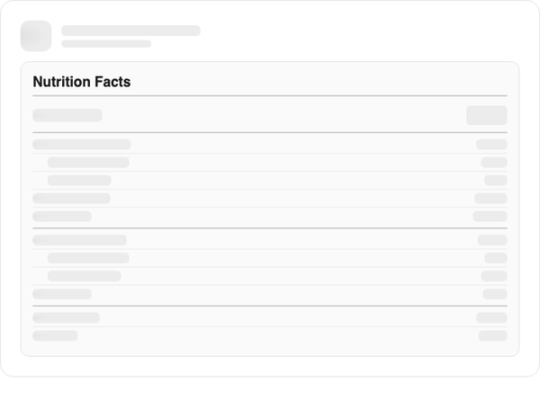
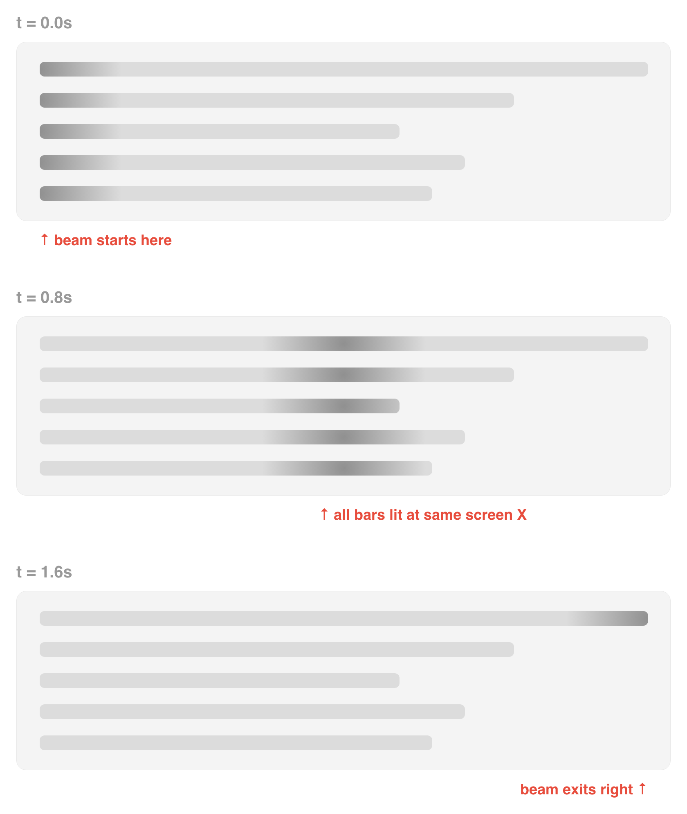
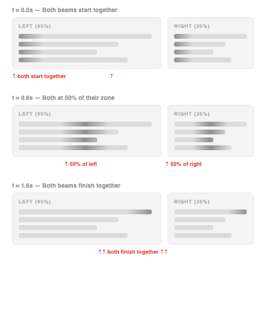

# SyncShimmer

A SwiftUI shimmer placeholder library where **all bars sweep in perfect sync** — like a flashlight beam sweeping across the screen.

Unlike per-element shimmer libraries that animate each view independently (causing mismatched diagonal sweeps), SyncShimmer uses a global timestamp and screen-position awareness so every placeholder lights up at the same screen X at the same instant.

<picture>
  <source media="(prefers-color-scheme: dark)" srcset="demo-dark.gif">
  <source media="(prefers-color-scheme: light)" srcset="demo.gif">
  
</picture>

## Features

- **Screen-synchronized** — all placeholders sweep in unison using `TimelineView` + `GeometryReader`
- **Dual-zone support** — left/right zones sweep at different speeds but restart together
- **Configurable** — duration, pause, colors, band width, opacity all tweakable
- **Light/dark mode** — adapts automatically, or set custom colors
- **Zero dependencies** — pure SwiftUI

### Single Zone (`.full`)

One beam sweeps left to right. All bars light up at the same screen X regardless of their width.



### Dual Zone (`.left` + `.right`)

Both zones share the same 0→1 phase. They always start and restart together, even though the left zone is wider. The left beam moves slower (more distance) while the right beam moves faster (less distance).



## Installation

### Swift Package Manager

```swift
.package(url: "https://github.com/pxlshpr/SyncShimmer.git", from: "1.0.0")
```

Then add `"SyncShimmer"` to your target's dependencies.

## Usage

### Basic Placeholder

```swift
import SyncShimmer

// Simple placeholder bar
SyncShimmerPlaceholder()
    .frame(width: 120, height: 14)
    .clipShape(RoundedRectangle(cornerRadius: 4))
```

### Dual-Zone (Left + Right)

When you have label/value pairs (like a nutrition label), use `.left` and `.right` zones so both sides sweep simultaneously but within their own width:

```swift
HStack {
    // Label side — sweeps across left 65% of screen
    SyncShimmerPlaceholder(zone: .left)
        .frame(width: 100, height: 14)
        .clipShape(RoundedRectangle(cornerRadius: 4))

    Spacer()

    // Value side — sweeps across right 35% of screen
    SyncShimmerPlaceholder(zone: .right)
        .frame(width: 40, height: 14)
        .clipShape(RoundedRectangle(cornerRadius: 4))
}
```

Both zones share the same phase (0→1), so they always start and restart at the same moment — even though the left sweep covers more distance.

### Full-Width Sweep

For standalone elements that should sweep across the entire screen:

```swift
SyncShimmerPlaceholder(zone: .full)
    .frame(height: 20)
    .clipShape(RoundedRectangle(cornerRadius: 6))
```

### Custom Zone

Define your own zone with explicit screen fractions:

```swift
// Middle 50% of screen, starting at 25%
SyncShimmerPlaceholder(zone: .custom(start: 0.25, width: 0.5))
    .frame(width: 80, height: 14)
```

### Shimmer Overlay on Existing Views

Apply a shimmer sweep over any existing view:

```swift
Text("Loading...")
    .syncShimmer(active: isLoading)
```

### Multiple Views in the Same Sweep

All `SyncShimmerPlaceholder` instances with the same zone automatically share one sweep. Just use them in your layout:

```swift
VStack(alignment: .leading, spacing: 8) {
    // All three bars sweep together — the beam passes through
    // each one at the moment it reaches that screen position
    SyncShimmerPlaceholder(zone: .full)
        .frame(width: 200, height: 16)
    SyncShimmerPlaceholder(zone: .full)
        .frame(width: 150, height: 12)
    SyncShimmerPlaceholder(zone: .full)
        .frame(width: 180, height: 12)
}
.clipShape(RoundedRectangle(cornerRadius: 6))
```

## Configuration

Tweak the global settings before your views appear:

```swift
// In your App init or onAppear:
SyncShimmerConfig.duration = 2.0          // slower sweep
SyncShimmerConfig.pauseFraction = 0.05    // 5% pause between cycles
SyncShimmerConfig.bandFraction = 0.5      // wider highlight band
SyncShimmerConfig.highlightPeakOpacity = 0.6
SyncShimmerConfig.highlightEdgeOpacity = 0.25

// Custom colors (overrides automatic light/dark adaptation)
SyncShimmerConfig.baseColor = Color.gray.opacity(0.1)
SyncShimmerConfig.highlightColor = Color.white.opacity(0.3)
```

### Defaults

| Setting | Default | Description |
|---------|---------|-------------|
| `duration` | 1.6s | One full sweep cycle |
| `pauseFraction` | 0.02 | Pause between cycles (fraction of duration) |
| `bandFraction` | 0.45 | Highlight band width (fraction of zone) |
| `highlightPeakOpacity` | 0.55 | Peak brightness at band center |
| `highlightEdgeOpacity` | 0.2 | Brightness at band edges |
| `baseColor` | auto | Adapts to light/dark mode |
| `highlightColor` | auto | Adapts to light/dark mode |

## How It Works

Instead of each bar animating its own gradient independently,
SyncShimmer uses ONE global timestamp. Every bar reads the same
time and computes where the highlight beam is on screen. The
result: a single "flashlight beam" that sweeps across and every
bar lights up as it passes through.

1. `TimelineView(.animation)` provides a continuous global timestamp
2. Each bar uses `GeometryReader` to find its screen position via `.frame(in: .global)`
3. A virtual "beam" position is computed from `(timestamp % duration) / duration` → 0...1 phase
4. The beam sweeps across the zone width; each bar maps it to local coordinates
5. A soft `LinearGradient` is positioned at the local beam position
6. Result: one beam, many bars, perfectly in sync

## License

```
            DO WHAT THE FUCK YOU WANT TO PUBLIC LICENSE
                    Version 2, December 2004

 Everyone is permitted to copy and distribute verbatim or modified
 copies of this license document, and changing it is allowed as long
 as the name is changed.

            DO WHAT THE FUCK YOU WANT TO PUBLIC LICENSE
   TERMS AND CONDITIONS FOR COPYING, DISTRIBUTION AND MODIFICATION

  0. You just DO WHAT THE FUCK YOU WANT TO.
```
